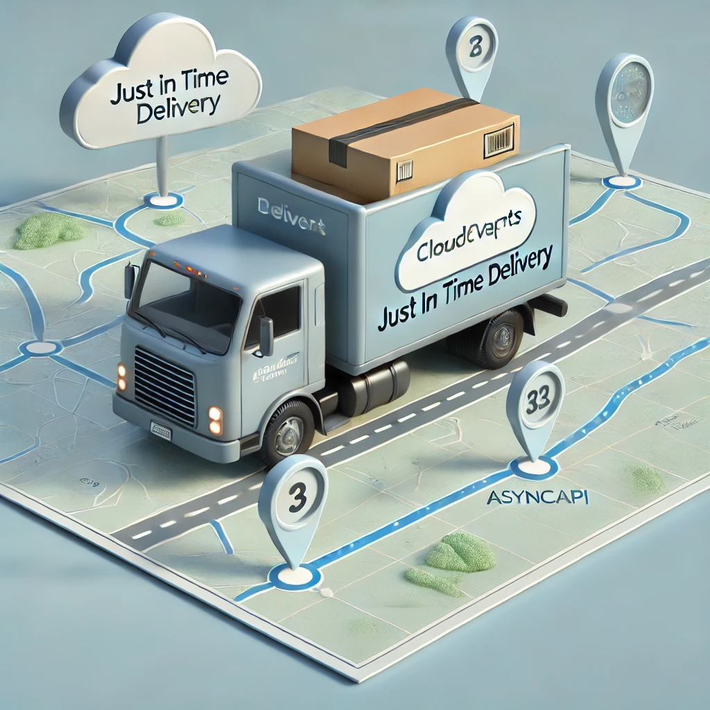
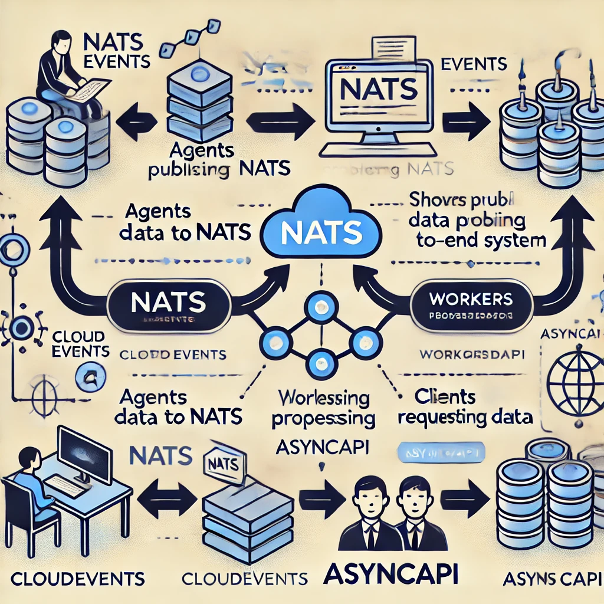
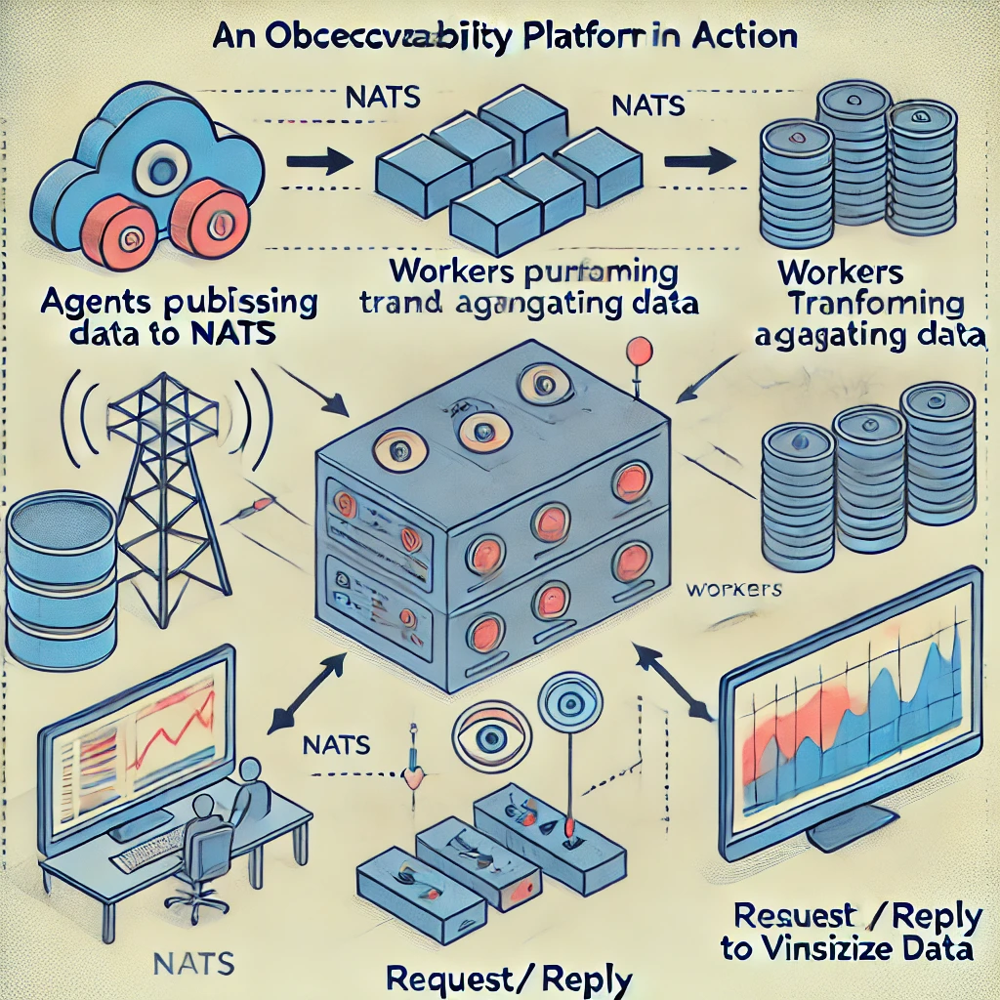

# Harmonizing Asynchronous Systems: NATS, CloudEvents, and AsyncAPI

## Slide 1: Title Slide
    Title: Harmonizing Asynchronous Systems: NATS, CloudEvents, and AsyncAPI
    Subtitle: A Just In Time Delivery Approach to Building Resilient Systems
--
Speaker Note: Welcome everyone! Today, we're going to take a fun journey through the world of asynchronous systems using a Just In Time delivery metaphor. We'll see how NATS, CloudEvents, and AsyncAPI can work together to create robust, scalable solutions. So, buckle up!

## Slide 2: Introduction    
Text: "Why Asynchronous?"
- Point 1: Scalability - Handle massive amounts of data and traffic.
- Point 2: Resilience - Systems can survive failures and continue operating.
- Point 3: Flexibility - Decouple services for easier updates and maintenance.
        

--    
Speaker Note: Asynchronous systems are like highways during rush hour—there’s a lot of traffic, and things need to keep moving. But unlike our morning commutes, we can design these highways to be super-efficient!

## Slide 3: The Just In Time Delivery Metaphor
Text: "The Key Players in Just In Time Delivery"
- NATS: The transportation system that ensures messages reach their destination swiftly.
- CloudEvents: The packaging that ensures each message is labeled with just enough metadata.
- AsyncAPI: The route planning system that defines how everything should flow.
    

--
Speaker Note: Picture a supply chain. NATS is like your transport truck, CloudEvents is the packaging, and AsyncAPI is the map. Together, they ensure your data is delivered just in time!

## Slide 4: NATS - The Transportation System
Text: "NATS: Fast, Lightweight, and Reliable Transport"
- Point 1: Low latency and high performance.
- Point 2: Supports multiple messaging patterns (e.g., pub/sub, request/reply).
- Point 3: Highly available with built-in resilience.
    

--
Speaker Note: NATS is like the fastest delivery fleet you can imagine. It’s built for speed and efficiency, ensuring that your data reaches its destination without delay. Whether you need a package delivered to one address or multiple, NATS has you covered.

## Slide 5: CloudEvents - The Packaging
Text: "CloudEvents: Just Enough Metadata (JEM)"
- Point 1: Lightweight, with essential metadata.
- Point 2: Enhances interoperability between systems.
- Point 3: Supports various event-driven architectures.
    

--
Speaker Note: Think of CloudEvents as the perfect packaging for your data. It wraps your messages with just enough information—no more, no less. This way, everyone along the route knows exactly what’s inside and how to handle it.

## Slide 6: AsyncAPI - The Route Planner
Text: "AsyncAPI: Mapping Out the Flow"
- Point 1: Defines how messages are sent and received.
- Point 2: Ensures consistency across services.
- Point 3: Provides clear documentation for developers.
    

--
Speaker Note: AsyncAPI is like your GPS for message delivery. It maps out the entire journey, so you know exactly where each message is going, how it gets there, and what to do when it arrives. It brings clarity and consistency to your system.

## Slide 7: How It All Comes Together
Text: "Building the System"
- Point 1: Agents publish data to NATS (messages in transit).
- Point 2: Workers process data (transform, aggregate).
- Point 3: Clients request data via request/reply (visualizing insights).
    

--
Speaker Note: Here’s how it all works in harmony. Agents (like IoT devices) publish data to NATS. Workers pick up these messages, process them, and prepare them for clients who request data on demand. CloudEvents packages each message, and AsyncAPI defines the flow. It’s seamless, just-in-time delivery for your data!

## Slide 8: Demo Time!
Text: "Live Demo: Observability Platform"
- Step 1: Show agents publishing events to NATS.
- Step 2: Demonstrate workers processing data.
- Step 3: Use request/reply to visualize the processed data.

--    
Speaker Note: Now, let’s see it in action. We’re going to simulate an observability platform. Watch as our agents send data, workers process it, and we visualize the results—all using NATS, CloudEvents, and AsyncAPI.

## Slide 9: Key Takeaways
Text: "Recap"
- Point 1: NATS - The transportation system for your data.
- Point 2: CloudEvents - The perfect packaging with Just Enough Metadata.
- Point 3: AsyncAPI - The route planner that ensures a smooth journey.

--
Speaker Note: As we wrap up, remember the key players in your system: NATS is the transportation, CloudEvents is the packaging, and AsyncAPI is the route planner. Together, they harmonize to create a resilient, efficient, and scalable asynchronous system.

## Slide 10: Q&A
Text: "Questions?"
- Point 1: Open floor for questions.

--
Speaker Note: I hope you enjoyed the journey! Now, let’s dive into your questions. Feel free to ask anything about how these tools work or how you can start using them in your projects.
